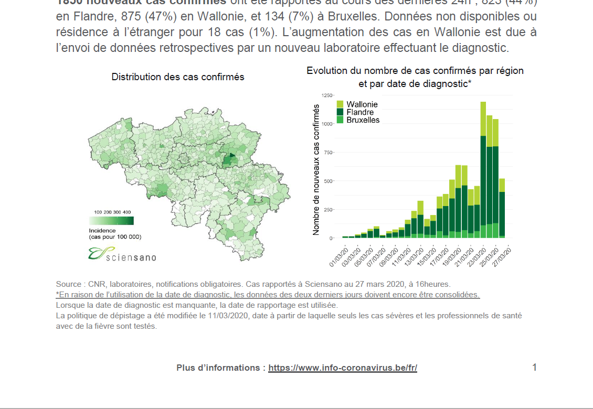
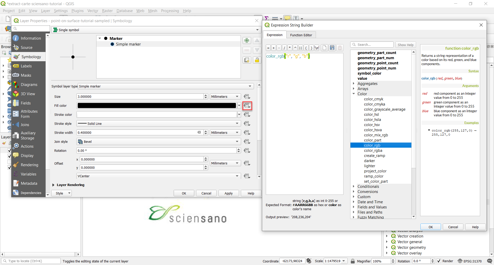
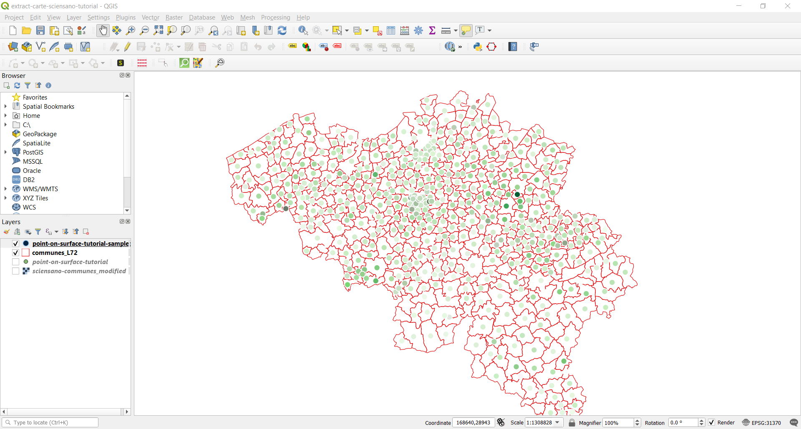
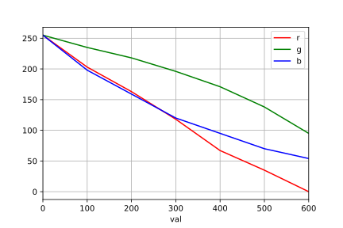

# Extract data from a raster choropleth map

## Introduction

[Sciensano](https://www.sciensano.be) has been in the eye of the cyclone lately in the context of the Covid-19 crisis.

Why? because they only publish(ed) a PDF file with the epidemiological information in Belgium. This PDF file contains some choropleth cartograms with the incidence (confirmed cases by 100k inhabitants) by commune.

The map is included in Word file which is itself [printed as PDF](https://epidemio.wiv-isp.be/ID/Documents/Covid19/Derni%c3%a8re%20mise%20%c3%a0%20jour%20de%20la%20situation%20%c3%a9pid%c3%a9miologique.pdf), according to the metadata.

In the PDF file, a map by commune is available in a quite low resolution.

We would like to extract the number of confirmed cases from this map. How? Here is the to-do list:

 * Extract the map as image
 * Georeference the map using a vector layer with all belgian communes as polygons
 * Compute a point inside the surface of each commune and sample the color at this point
 * Compute the value of confirmed cases from the sampled color

## Extract the map as image
 * Download the PDF file from [here](https://epidemio.wiv-isp.be/ID/Documents/Covid19/Derni%c3%a8re%20mise%20%c3%a0%20jour%20de%20la%20situation%20%c3%a9pid%c3%a9miologique.pdf)
 * Take a screenshot or extract the image of the map from the PDF file.

## Georeference the map using a vector layer with all belgian communes as polygons

### Get QGIS

Download QGIS from [https://www.qgis.org](https://www.qgis.org).

### Get a Shapefile with belgian communes as polygons

You can download a Shapefile of belgian communes under the title "Municipalities" from [this page on Atlas-Belgique.be](https://www.atlas-belgique.be/index.php/en/resources/map-data/) ([direct link](https://www.atlas-belgique.be/cartodata/communes_L72.rar)).

### Use QGIS to georeference the image map from the PDF

 * Create a new project in QGIS
 * Import the Shapefile with the communes: drag and drop "communes_L72.shp" to the map canvas, or add it via Layers > Add Layer > Add Vector Layer `Ctrl+Shift+V`.
 * Right-click on the `communes_L72`, go to Properties and set the coordinate reference system (CRS) to `EPSG:31370 * Belge 1972 / Belgian Lambert 72`:

 * You can also change the symbology to only show the outline:

 * Also check that the project CRS is `EPSG:31370` in the right-bottom corner. It should look like this:

 * Open the Georeferencer tool and load your extracted image or screenshot from File > Open raster:

 * I have used the following setting from Settings > Transformation Settings:

 * Then, add some ground control points (GCP). 8-10 evenly distributed GCPs should be enough. You need to click on the image as well as on the map canvas. Try to find some recognizable shapes like sharp edges etc.

([video](img-readme/90-add-gcp.mp4))

 * Click on File > Start Georeferencing to add the map on the canvas

## Compute a point inside the surface of each commune and sample the color at this point

 * Open the Processing Toolbox from Processing > Toolbox. Use the Vector Geometry > Point on Surface tool to compute a point inside each polygon from the communes layer. "Point on Surface" is better than "Centroids" because centroids can fall outside the surface of a polygon for concave shapes. Point on Surface enforces that the points lies inside the polygon's surface.

([video](img-readme/110-use-point-on-surface.mp4))

 * Please note that it does not always work that well for smaller communes because the source raster's resolution is too low. For very concave communes, the points may lie on the border. You can always move them manually with the Vertex tool ([video](img-readme/120-move-incorrect-points.mp4)).

 * To sample the color from the raster image at the point's location, go to the Processing Toolbox and open the Raster analysis > Sample raster values tool. Save the layer as GeoJSON:

* In the new layer, go to Properties, enable editing mode by clicking on the pencil and rename fields `rvalue_1`, `rvalue_2`, `rvalue_3` and `rvalue_4` to `r`, `g`, `b` and `a`.

 * We can also set the points' color to the same color as the raster by using a data-driver property for the marker's color:

## Compute the value of confirmed cases from the sampled color

Now we want to predict the number of cases/100k inhab. but using the color. There are three colors: (r)ed, (g)reen and (b)lue.

 * First we can use the Identify Features tool to retrieve the RGB values from the legend for the `100`, `200`, `300` and `400` values. We alse assume that `0` is white (`255,255,255`). Here is the result:

| val | r   | g   | b   |
|-----|-----|-----|-----|
| 0   | 255 | 255 | 255 |
| 100 | 188 | 228 | 182 |
| 200 | 139 | 206 | 137 |
| 300 | 76  | 174 | 96  |
| 400 | 31  | 130 | 66  |

 * Our sampling method is not very accurate. If we plot the three colors in function of the value, we can see that the three are "mostly" linear:

